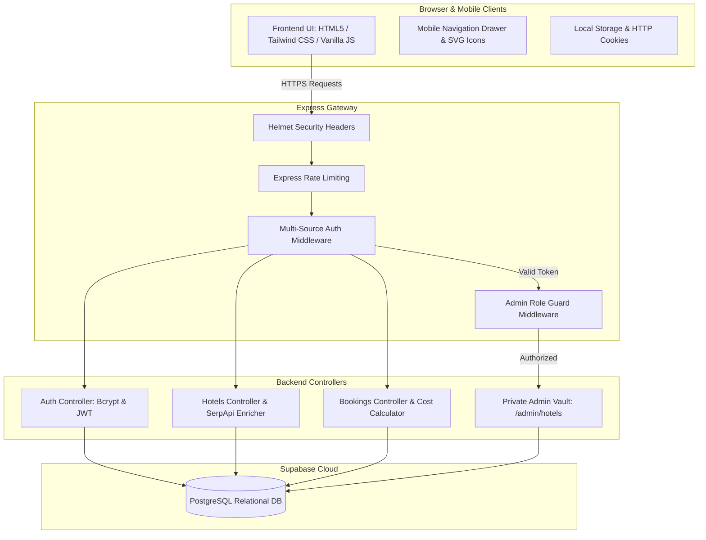
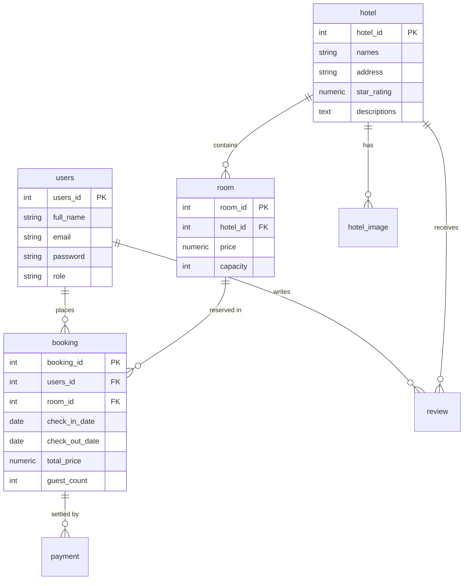

<div align="center">

  # 🏨 CheckIn.com — Enterprise Hotel Booking Platform

  <p align="center">
    <strong>A high-performance, full-stack commercial hotel reservation system built with Node.js, Express, PostgreSQL, Tailwind CSS v4, and automated CI/CD.</strong>
  </p>

  <p align="center">
    <a href="https://github.com/iranalex360/Hotel-Booking-System-CSE4500"></a>
    <a href="https://hotel-booking-system-cse4500.onrender.com"></a>
    <a href="#"></a>
    <a href="#"></a>
  </p>

</div>

---

## 🌟 Executive Summary

**CheckIn.com** is a full-stack, enterprise-grade hotel booking platform designed to replicate the sleek UX, real-time availability math, security hardening, and reliability of tier-1 commercial booking engines like Expedia or Booking.com.

The platform handles real-time hotel discovery, dynamic guest capacity filtering, automated stay cost calculations, instant reservation booking, automated receipt generation (`CHKIN-XXXXXX`), and an administrative management portal guarded by server-side role security.

---

## 🚀 Key Engineering & Security Highlights (Recruiter Showcase)

### 🛡️ 1. Enterprise Security Engineering
- **Multi-Source Session Auth:** Token extraction middleware automatically parses JWT credentials from `Authorization: Bearer` headers, HTTP cookies (`req.cookies.token`), or query strings.
- **Server-Side Route Vault:** Administrative pages (`backend/admin/add-hotel-image.html`) are isolated outside the public static directory and served only after server-side token & role verification (`role === 'admin'`). Unauthenticated requests are immediately redirected to `/auth.html`.
- **Defense in Depth:** Protected against web vulnerabilities using **Helmet** security headers, **Bcrypt** password hashing, and **Express Rate Limiting**.

### 🔒 2. SQL Injection Immunity & Database Integrity
- **100% Parameterized SQL:** All PostgreSQL queries use parameterized placeholders (`$1, $2`), immunizing the backend against SQL injection attacks.
- **Transactional Safety:** Critical booking operations execute within strict PostgreSQL transactions (`BEGIN` ... `COMMIT` / `ROLLBACK`) to eliminate race conditions and double bookings.
- **Referential Integrity:** Supabase PostgreSQL cloud database designed with cascading constraints (`ON DELETE CASCADE`) across 6 core entities.

### 🎨 3. Modern Glassmorphism UI & Mobile Responsiveness
- **Tailwind CSS v4 Aesthetic:** Curated glassmorphism design featuring backdrop blurring (`backdrop-blur-md`), dark mode elements, and custom HSL color palettes.
- **Pure SVG Vector Icons:** 100% emoji-free UI utilizing crisp vector SVG icons for hotels, search, bookings, contacts, print receipts, and star ratings.
- **Responsive Navigation Drawer:** Smooth mobile hamburger drawer (`☰` $\rightarrow$ `✕`) with integrated authentication state management.

### 🧪 4. Automated Testing & Verification Suite
- **100% Pass Rate:** 19 automated unit & integration tests written with **Jest** and **Supertest** covering business math, JWT verification, RBAC middleware, and error handling contracts.

### 🔄 5. Continuous Integration & Deployment (CI/CD)
- **GitHub Actions Pipeline:** Automated `.github/workflows/ci-cd.yml` pipeline that builds Tailwind assets, executes unit tests, and triggers continuous deployment to **Render**.

---

## 🛠️ Technology Stack

| Layer | Technology | Engineering Highlights |
| :--- | :--- | :--- |
| **Frontend UI** | HTML5, Tailwind CSS v4, JavaScript (ES6+) | Glassmorphism UX, responsive layouts, mobile drawer |
| **Icons & Media** | Pure SVG Vector Icons | Crisp, resolution-independent vector assets |
| **Backend API** | Node.js (v18+), Express.js | Asynchronous RESTful routing architecture |
| **Database** | PostgreSQL (Supabase Cloud) | Connection pooling, relational schema, transaction locks |
| **Auth & Security** | JWT (`jsonwebtoken`), `bcryptjs`, `helmet` | Multi-source token verification, RBAC, HTTP security headers |
| **Testing** | Jest, Supertest | Unit testing business math & API endpoint contracts |
| **DevOps & Hosting** | GitHub Actions, Render | Automated CI/CD build, test, & production deployment |

---

## 📐 Architecture & System Flow

### System Architecture Flow



---

### Database Entity-Relationship (E-R) Diagram



---

## 📦 Key Application Features

### 1. Dynamic Hotel Search & Filtering (`search.html`)
- Real-time search across hotel names and locations.
- Capacity filtering by guest count.
- Infinite load pagination (`HOTEL_LIMIT = 21`).

### 2. Hotel Details & Room Reservation (`hotel-details.html`)
- Interactive booking modal with date validation.
- Dynamic night calculation and live total price estimation.

### 3. Automated Printable Receipt (`booking-confirmation.html`)
- Instant redirection post-reservation.
- Generates confirmation numbers (`CHKIN-XXXXXX`), stay details, and printable receipt support (`window.print()`).

### 4. User Booking & Review Dashboard (`bookings.html`)
- Separates **Current Bookings** from **Previous Bookings**.
- Verified guest review modal for submitting hotel ratings and feedback.

### 5. Private Administrative Portal (`/admin/hotels`)
- Protected admin dashboard for updating hotel links, images, or deleting entries.

---

## 🧪 Automated Testing & QA

Run the full automated test suite locally:

```bash
cd backend
npm test
```

### Test Suite Execution Output:
```text
PASS tests/adminRoutes.test.js
PASS tests/authMiddleware.test.js
PASS tests/adminMiddleware.test.js
PASS tests/bookingLogic.test.js
PASS tests/errorHandler.test.js

Test Suites: 5 passed, 5 total
Tests:       19 passed, 19 total
Snapshots:   0 total
Time:        1.548 s
```

---

## 💻 Local Setup & Installation

### 1. Clone Repository
```bash
git clone https://github.com/iranalex360/Hotel-Booking-System-CSE4500.git
cd Hotel-Booking-System-CSE4500
```

### 2. Install Dependencies & Build CSS
```bash
# Root setup
npm install

# Compile Tailwind CSS
cd frontend
npm install
npx @tailwindcss/cli -i ./src/input.css -o ./dist/output.css

# Setup Backend
cd ../backend
npm install
```

### 3. Environment Variables Configuration
Create a `.env` file in the `backend/` directory:
```env
DB_HOST=aws-0-us-west-1.pooler.supabase.com
DB_PORT=6543
DB_DATABASE=postgres
DB_USER=postgres.sucqfpwsyfpsjgpqgcoj
DB_PASSWORD=your_password
PORT=3000
JWT_SECRET=your_jwt_secret_key
```

### 4. Run Application Locally
```bash
cd backend
npm start
```
Open **`http://localhost:3000`** in your browser!

---

## 📄 License & Credits

Built for CSE 4500 Platform Computing. Distributed under the MIT License.
