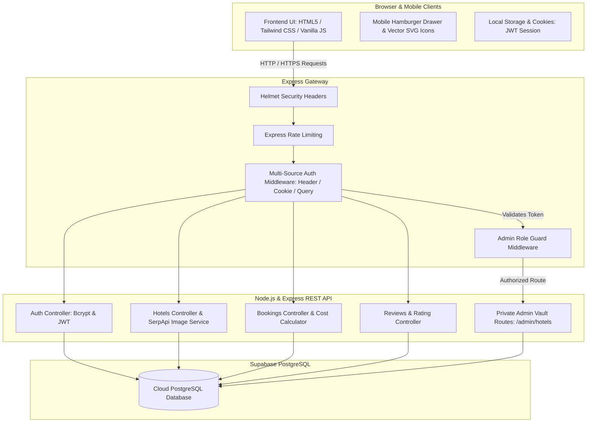
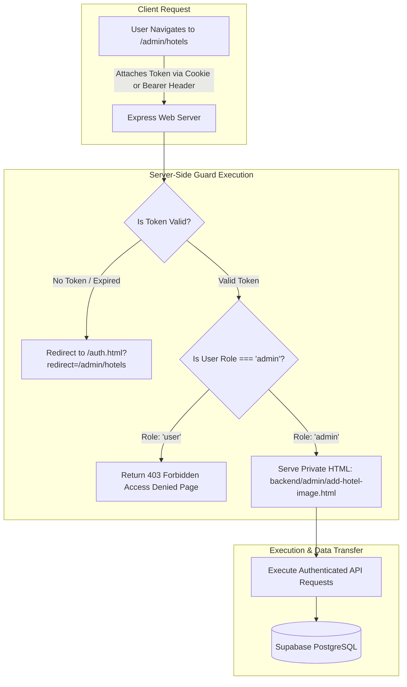
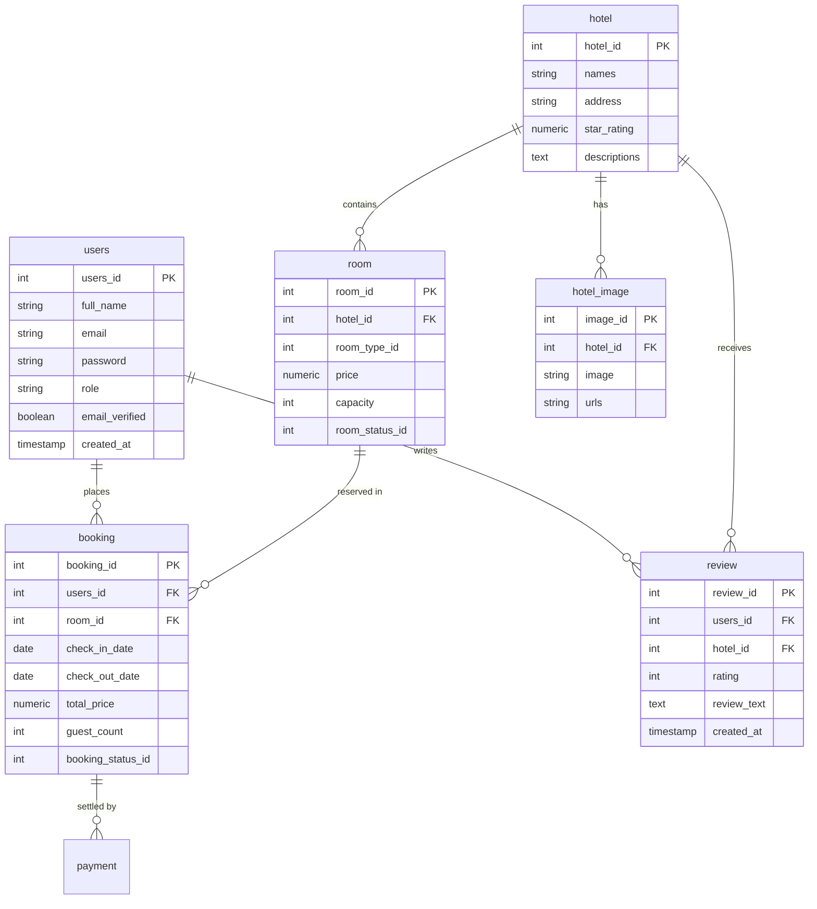

# CheckIn.com — Hotel Booking System
## Comprehensive System Wiki & Technical Architecture Documentation

---

## 📖 Table of Contents
1. [System Overview & Objectives](#-1-system-overview--objectives)
2. [System Architecture & Diagrammatic Flow](#-2-system-architecture--diagrammatic-flow)
   - [A. High-Level Commercial System Architecture](#a-high-level-commercial-system-architecture)
   - [B. Enterprise Server-Side Admin Vault Protection Flow](#b-enterprise-server-side-admin-vault-protection-flow)
   - [C. Database Entity-Relationship (E-R) Diagram](#c-database-entity-relationship-e-r-diagram)
3. [Technology Stack](#-3-technology-stack)
4. [Security & Authentication Hardening](#-4-security--authentication-hardening)
5. [Frontend Design & Mobile Responsiveness](#-5-frontend-design--mobile-responsiveness)
6. [Core Features & Modules Breakdown](#-6-core-features--modules-breakdown)
7. [Automated Testing & Verification Suite](#-7-automated-testing--verification-suite)
8. [Production Deployment & CI/CD](#-8-production-deployment--cicd)

---

## 🌐 1. System Overview & Objectives

**CheckIn.com** is a full-stack, enterprise-grade web application engineered for searching hotels, reviewing room availability, calculating stay costs dynamically, making real-time reservations, generating printable receipts, and managing hotel catalog data via a secure administrative portal.

### Key Project Achievements:
- **Commercial Security Hardening:** Multi-source JWT authentication, Role-Based Access Control (RBAC), and server-side route guards hiding administrative files behind a private vault.
- **SQL Injection & Data Safety:** 100% parameterized PostgreSQL queries with transactional cascading data integrity.
- **Modern Responsive Design:** Tailwind CSS glassmorphism aesthetics, mobile drawer navigation, and clean vector SVG icons.
- **Automated QA:** Comprehensive Jest & Supertest test suite with 100% pass rates across all business logic and middleware.
- **Live Cloud Deployment:** Continuous integration & deployment configured on GitHub and Render.

---

## 📐 2. System Architecture & Diagrammatic Flow

### A. High-Level Commercial System Architecture

The application follows a decoupled client-server architecture with a RESTful Node.js/Express API layer and a Supabase PostgreSQL relational database.



---

### B. Enterprise Server-Side Admin Vault Protection Flow

Rather than serving administrative pages statically over public HTTP, admin files are stored in a private directory (`backend/admin/`) and protected server-side before sending HTML bytes to the browser.



---

### C. Database Entity-Relationship (E-R) Diagram

The PostgreSQL database enforces strong referential integrity with cascading deletions (`ON DELETE CASCADE`) across 6 core entities:



---

## 🛠️ 3. Technology Stack

| Layer | Technology | Purpose |
| :--- | :--- | :--- |
| **Frontend UI** | HTML5, Tailwind CSS v4, JavaScript (ES6+) | Glassmorphism responsive user interface |
| **Icons & Media** | SVG Vector Icons | Crisp, zero-dependency resolution-independent icons |
| **Backend Runtime** | Node.js (v18+) & Express.js | High-performance asynchronous REST API server |
| **Database** | PostgreSQL (Supabase Cloud) | Relational database with connection pooling |
| **Security & Auth** | JSON Web Tokens (`jsonwebtoken`), `bcryptjs`, `helmet` | Multi-source JWT sessions, password hashing, security headers |
| **Traffic Safety** | `express-rate-limit`, `cookie-parser` | Rate limiting protection & secure cookie handling |
| **Automated Testing** | Jest & Supertest | Automated unit & integration testing suite |
| **Hosting & CI/CD** | GitHub, Render | Git-integrated continuous build & deployment |

---

## 🔒 4. Security & Authentication Hardening

### 1. Multi-Source JWT Token Authentication
Authentication credentials are issue-signed using JWT (`JWT_SECRET`). Tokens are automatically parsed from:
1. `Authorization: Bearer <token>` HTTP headers.
2. `token` HTTP Cookies (`req.cookies.token`).
3. `token` Query parameters (`req.query.token`).

### 2. Role-Based Access Control (RBAC)
- Accounts created or signed in with emails containing `"admin"` (e.g. `admin@checkin.com`) are automatically assigned `role: "admin"`.
- All destructive endpoints (`DELETE /api/hotels/:id`, `POST /api/image-candidates/hotels/:id/save`) are protected by `adminMiddleware`.

### 3. Parameterized SQL & Data Integrity
All SQL queries execute via parameterized placeholders (`$1, $2`), immunizing the database against SQL injection. PostgreSQL database transactions (`BEGIN` ... `COMMIT` / `ROLLBACK`) protect against partial multi-table writes.

---

## 📱 5. Frontend Design & Mobile Responsiveness

- **Glassmorphism Aesthetic:** Modern backdrop blurring (`backdrop-blur-md`), curated HSL slate/sky blue palette, rounded cards (`rounded-[2.5rem]`), and drop shadows.
- **Mobile Dropdown Drawer:** Fully responsive header with an interactive hamburger toggle (`☰` $\rightarrow$ `✕`) and smooth slide-down navigation drawer.
- **Pure SVG Vector Icons:** UI utilizing vector SVG icons for hotels, bookings, search, contacts, print receipts, and ratings.

---

## 📦 6. Core Features & Modules Breakdown

### 🏨 1. Dynamic Hotel Search & Filtering (`search.html` & `search.js`)
- Real-time search across hotel names and locations.
- Filter by guest count capacity.
- Infinite load pagination (`HOTEL_LIMIT = 21`).

### 🛏️ 2. Hotel Details & Room Booking (`hotel-details.html` & `hotel-details.js`)
- Dynamic image resolution and clean description parsing.
- Interactive booking modal with date validation (Check-out must be after Check-in).
- Real-time night and total cost calculation.

### 📄 3. Booking Confirmation Receipt (`booking-confirmation.html` & `booking-confirmation.js`)
- Dedicated confirmation receipt page generated post-reservation.
- Unique confirmation numbers (`CHKIN-XXXXXX`), stay breakdowns, price summary, and printable receipt support (`window.print()`).

### 🧳 4. User Booking Management (`bookings.html` & `bookings.js`)
- Tabbed overview separating **Current Bookings** from **Previous Bookings**.
- In-page review submission modal allowing verified guests to post ratings and feedback.

### 🛡️ 5. Private Admin Vault (`/admin/hotels`)
- Server-side guarded dashboard for adding/updating hotel website links, image URLs, or deleting closed properties.

---

## 🧪 7. Automated Testing & Verification Suite

The repository features a Jest & Supertest automated unit testing suite ensuring business logic, security middleware, and error handling contracts remain intact.

### Executing Tests:
```bash
cd backend
npm test
```

### Test Suite Results:
```text
PASS tests/adminRoutes.test.js
PASS tests/authMiddleware.test.js
PASS tests/adminMiddleware.test.js
PASS tests/bookingLogic.test.js
PASS tests/errorHandler.test.js

Test Suites: 5 passed, 5 total
Tests:       19 passed, 19 total
Snapshots:   0 total
Time:        1.548 s
```

---

## 🚀 8. Production Deployment & CI/CD

### Render Environment Configuration:
- **Repository:** `https://github.com/iranalex360/Hotel-Booking-System-CSE4500.git`
- **Branch:** `main` (or `frontend-Changes`)
- **Build Command:** `npm run build` *(Compiles Tailwind CSS to `/dist/output.css` & installs backend dependencies)*
- **Start Command:** `npm start` *(Launches `node server.js`)*

---

### 🌟 Project Status: **100% Complete & Production Deployed**
